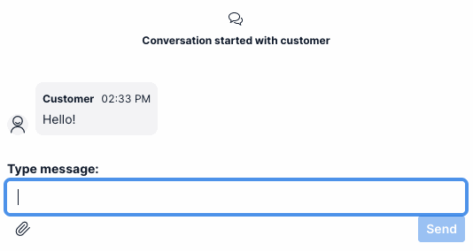

# Chat Commands Flex Plugin

This plugin adds custom "slash commands" to Flex UI 2.x messaging.



## Disclaimer

- **This software is to be considered "sample code", a Type B Deliverable, and is delivered "as-is" to the user. Twilio bears no responsibility to support the use or implementation of this software.**
- This plugin replaces the default message input component. We have tested this alongside various other plugins and haven't seen compatibility issues so far, however, this is something to be mindful of.
- It is recommended to fork this plugin so that you can maintain a repository with your own custom chat commands.

## Pre-requisites

This plugin is designed for usage with Flex UI 2.x only.

Make sure you have [Node.js](https://nodejs.org) as well as [`npm`](https://npmjs.com) installed.

Next, please install the [Twilio CLI](https://www.twilio.com/docs/twilio-cli/quickstart). If you are using Homebrew on macOS, you can do so by running:

```bash
brew tap twilio/brew && brew install twilio
```

Finally, install the [Flex Plugin extension](https://www.twilio.com/docs/flex/developer/plugins/cli/install) for the Twilio CLI:

```bash
twilio plugins:install @twilio-labs/plugin-flex
```

## Installation

First, clone the repository and change to its directory:

```bash
git clone https://github.com/twilio-professional-services/plugin-chat-commands.git

cd plugin-chat-commands
```

Copy `public/appConfig.example.js` to `public/appConfig.js`:

```bash
cp public/appConfig.example.js public/appConfig.js
```

Install the dependencies:

```bash
npm install
```

Run the plugin locally:

```bash
twilio flex:plugins:start
```

## Customizing Commands

All chat commands are located in the `src/commands` directory. You can create new commands, modify, or remove the existing commands. Modify `src/commands/index.js` to reference the commands you wish to be usable in Flex.

The command's callback function is called when a user selects it. You may modify the message input text, send a message immediately, trigger some other functionality, etc.

The following sample commands are included:

- **/date** Inserts the current date into the message
- **/done** Wraps up and completes the current task
- **/hello** Inserts "Hello (customer name)!" into the message, using the `name` task attribute
- **/smile** Immediately sends the 😀 emoji, without modifying the current input contents

## Known Issue

The built-in "attach files" button will clear the input field. Using a custom attachment implementation (such as [the custom message media example plugin](https://github.com/twilio-professional-services/plugin-custom-message-media)) avoids this issue.

## Paste combobox primitive example

Also included is an unused `MessageInputWithCommandsPrimitive` component which is functionally identical to the `MessageInputWithCommands` component, however it is using the Paste combobox primitive to allow rendering a pure HTML textarea instead of the default Paste one-line input component.

## Development

Run `twilio flex:plugins --help` to see all the commands we currently support. For further details on Flex Plugins refer to our documentation on the [Twilio Docs](https://www.twilio.com/docs/flex/developer/plugins/cli) page.

